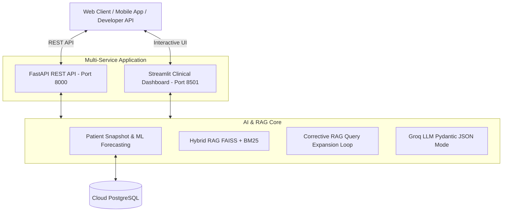

# 🧬 Digital Twin AI — Hybrid Clinical Decision Support System (CDSS)

Evidence-based clinical decision support system for liver health monitoring using **Hybrid RAG**, **Corrective RAG (CRAG)**, **Pydantic Schema Validation**, **FastAPI REST API**, and a **Streamlit Web Dashboard**.

---

## 🌟 Architecture & Features



- **Longitudinal Biomarker Analytics**: Tracks liver panel metrics (`ALT`, `AST`, `ALP`, `TBIL`, `DBIL`, `Albumin`, `A/G Ratio`).
- **Clinical Risk & Fibrosis Scores**: Calculates **FIB-4 Index**, **APRI Score**, and **De Ritis Ratio (AST/ALT)** with automated risk tier badges (`Low Risk 🟢`, `Moderate Risk 🟡`, `High Risk 🔴`).
- **ML Trajectory Forecasting**: Projects 90-day (+3 months) and 180-day (+6 months) future biomarker values.
- **Biomedical Hybrid RAG**: Merges `PubMedBERT` dense FAISS embeddings ($d=768$) and BM25 sparse keyword search via **Reciprocal Rank Fusion (RRF)**.
- **Cross-Encoder Reranking**: Re-scores top evidence chunks using `BAAI/bge-reranker-base`.
- **Corrective RAG (CRAG)**: Evaluates evidence relevance quality and automatically triggers domain sub-query expansion if initial relevance is low.
- **Guaranteed Pydantic JSON Schema**: Calls Groq API in JSON mode validated with Pydantic schemas (`ClinicalDiagnosis`).
- **Hybrid Deployment**: Exposes both a **FastAPI REST API** (`/docs`) and a **Streamlit UI Dashboard**.

---

## 🚀 Quick Start (Local Development)

### 1. Environment Setup
Create a `.env` file from the template:
```bash
cp .env.example .env
```
Fill in your `GROQ_API_KEY` and PostgreSQL `DATABASE_URL`.

### 2. Run FastAPI REST Backend
```bash
uvicorn app.api.main:app --reload --port 8000
```
- Swagger UI Documentation: [http://localhost:8000/docs](http://localhost:8000/docs)
- Health Check: `GET http://localhost:8000/health`

### 3. Run Streamlit UI Dashboard
```bash
streamlit run streamlit_app.py
```
- Streamlit Dashboard: [http://localhost:8501](http://localhost:8501)

---

## 🐳 Docker Deployment

Run both the **FastAPI REST Backend** and **Streamlit Dashboard** simultaneously using Docker Compose:

```bash
docker-compose up --build
```
- **FastAPI REST API**: [http://localhost:8000/docs](http://localhost:8000/docs)
- **Streamlit Dashboard**: [http://localhost:8501](http://localhost:8501)

---

## 📡 REST API Reference

| Method | Endpoint | Description |
| :--- | :--- | :--- |
| `GET` | `/health` | System health check & DB connection ping |
| `GET` | `/api/v1/patients/{id}/snapshot` | Returns patient metrics & clinical risk scores (FIB-4, De Ritis) |
| `POST` | `/api/v1/patients/{id}/analyze` | Executes full RAG Diagnosis Pipeline & returns JSON report |
| `GET` | `/docs` | Interactive Swagger OpenAPI Documentation |

---

## ☁️ Cloud Deployment Options

### Option 1: Render.com (1-Click Deployment)
Connect your GitHub repository to Render and use `render.yaml`. It automatically provisions both services.

### Option 2: Streamlit Community Cloud
Push to GitHub, connect to [share.streamlit.io](https://share.streamlit.io), and set `GROQ_API_KEY` and `DATABASE_URL` in Secrets.
